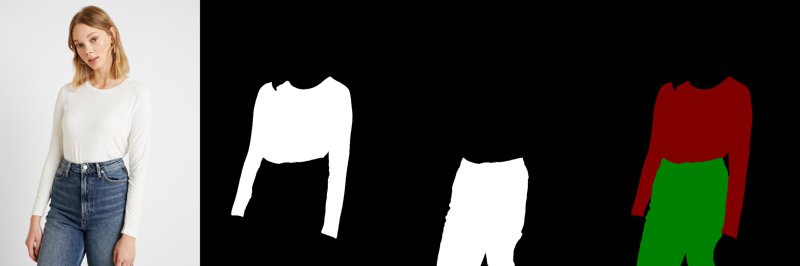
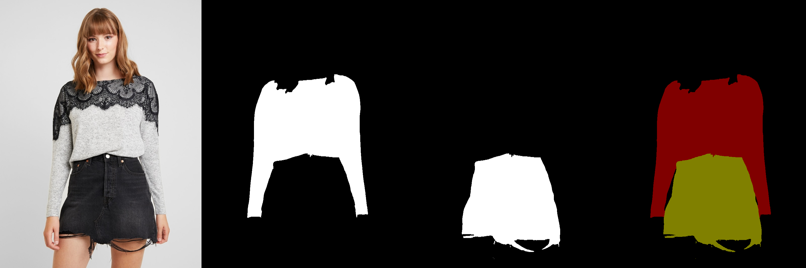

# Huggingface cloth segmentation using U2NET

This repo contains inference code and gradio demo script using pre-trained U2NET model for Cloths Parsing from human portrait. 
Here clothes are parsed into 3 category: Upper body(red), Lower body(green) and Full body(yellow). The provided script also generates alpha images for each class. 

# Inference
- clone the repo `git clone https://github.com/wildoctopus/huggingface-cloth-segmentation.git`.
- Install dependencies `pip install -r requirements.txt`
- Run `python process.py --image 'input/03615_00.jpg'` . **Script will automatically download the pretrained model**. 
- Outputs will be saved in `output` folder.
- `output/alpha/..` contains alpha images corresponding to each class.
- `output/cloth_seg` contains final segmentation.
- 

# Gradio Demo
- Run `python app.py`
- Navigate to local or public url provided by app on successfull execution. 
### OR 
- Inference in colab from here 

# Huggingface Demo 
- Check gradio demo on Huggingface space from here [huggingface-cloth-segmentation](https://huggingface.co/spaces/wildoctopus/cloth-segmentation).

# Output samples

This model works well with any background and almost all poses. 

# Acknowledgements
- U2net model is from original [u2net repo](https://github.com/xuebinqin/U-2-Net). Thanks to Xuebin Qin for amazing repo.
- Most of the code is taken and modified from  [levindabhi/cloth-segmentation](https://github.com/levindabhi/cloth-segmentation)
